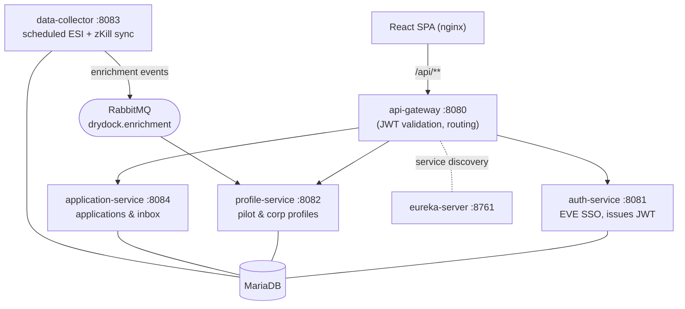

# FINDACORP

> A third-party recruitment platform for **EVE Online** — pilots build a real, data-driven profile from ESI + zKillboard, and corp recruiters search by what actually matters: timezone overlap, skill points, activity, and content type.

No more `20m SP DPS LFC` forum posts. FINDACORP aggregates a pilot's public game data into a recruiter-facing profile, and gives corporations a listing page, an applicant inbox, and an HR search tool.

*(DRYDOCK is the internal codename for this monorepo.)*

---

## Table of contents

- [Features](#features)
- [Architecture](#architecture)
- [Tech stack](#tech-stack)
- [How the data flows](#how-the-data-flows)
- [Getting started](#getting-started)
- [Configuration](#configuration)
- [API routing](#api-routing)
- [Testing](#testing)
- [Deployment](#deployment)
- [Project structure](#project-structure)

---

## Features

- **Pilot profiles** — skills (name / level / SP), corp history with alliance context, kill/loss history with ISK values, a 7×24 activity heatmap, and inferred prime-time timezone — all enriched from ESI and zKillboard.
- **Corp listings** — recruiters publish a pitch, requirements (mandatory or optional), prime-time hours, languages, roles wanted, and recruitment status (open / selective / closed).
- **HR tooling** — the CEO and appointed HR managers (up to 2) can edit the listing, search pilots, and review applications.
- **Applications & inbox** — a generic threaded messaging model for applications (pilot ↔ corp), recruiter DMs, and system notifications (e.g. CEO-change alerts).
- **EVE SSO login** — OAuth2 + PKCE against EVE Online; the platform only requests read-only public + skills scopes.
- **Global search** — ⌘/Ctrl+K to search pilots and corps from anywhere.

---

## Architecture

FINDACORP is a Spring Boot **microservices monorepo** behind a Eureka registry and a Spring Cloud Gateway, with a React single-page app served by nginx.



| Service | Port | Responsibility | Database |
|---|---|---|---|
| `eureka-server` | 8761 | Service registry / discovery | — |
| `api-gateway` | 8080 | Spring Cloud Gateway, JWT validation, CORS, routing | — |
| `auth-service` | 8081 | EVE SSO OAuth2 + PKCE, issues/refreshes JWTs | `auth_db` |
| `profile-service` | 8082 | Pilot & corp profiles + enrichment data, search | `profile_db` |
| `data-collector` | 8083 | Scheduled ESI + zKillboard sync, publishes enrichment events | `collector_db` |
| `application-service` | 8084 | Recruitment applications & in-app messaging | `application_db` |
| `common` | — | Shared DTOs and RabbitMQ event/constant definitions (library, no image) | — |

---

## Tech stack

**Backend**
- Java 21, Spring Boot 3.3.5, Spring Cloud 2023.0.3
- Spring Cloud Gateway, Netflix Eureka, OpenFeign
- MariaDB (Flyway migrations on `application-service`; `schema.sql` on `profile-service`)
- RabbitMQ for async enrichment events
- Resilience4j circuit breakers + rate limiters on external API calls
- JWT (jjwt), Lombok, MapStruct, Jackson

**Frontend**
- React 19, TypeScript, Vite
- React Router v7, TanStack Query 5, Axios
- Served in production by nginx (see [`frontend/Dockerfile`](frontend/Dockerfile))

**External data sources**
- [ESI](https://esi.evetech.net/) — EVE's official API (skills, corp history)
- [zKillboard](https://zkillboard.com/) — kill/loss history (rate-limited to 1 req/s)
- [EVE Who](https://evewho.com/) — public corp roster

---

## How the data flows

1. A user logs in via **EVE SSO** → `auth-service` issues a JWT, stored in the browser.
2. The **api-gateway** validates the JWT on every protected request and forwards `X-Character-Id` / `X-Character-Name` headers downstream.
3. **data-collector** runs scheduled jobs (pilots ~every 6h, corps ~every 12h): it pulls ESI skills/corp-history and zKillboard kills/losses, then publishes `PilotEnrichedEvent` / `CorpEnrichedEvent` to the `drydock.enrichment` RabbitMQ exchange.
4. **profile-service** listeners consume those events and upsert the enriched data into MariaDB.
5. The SPA reads profiles and search results from **profile-service**, and applications/messages from **application-service**.

---

## Getting started

### Prerequisites

- **JDK 21** (the build targets Java 21; newer JDKs may break Lombok)
- **Maven 3.9+**
- **Node.js 22** + npm
- A running **MariaDB** and **RabbitMQ** (local or remote)

### Backend

Build the whole stack (compiles `common` first via `-am`):

```bash
mvn -DskipTests clean package
```

Run a single service (each is a standalone Spring Boot app). Start `eureka-server` and `api-gateway` first, then the rest:

```bash
mvn -pl services/eureka-server spring-boot:run
mvn -pl services/api-gateway   spring-boot:run
mvn -pl services/auth-service  spring-boot:run
# …profile-service, data-collector, application-service
```

> Each service reads its config (DB, RabbitMQ, Eureka, secrets) from environment variables / `application-local.yml`, so the same build runs against any environment. See [Configuration](#configuration).

### Frontend

```bash
cd frontend
npm install
npm run dev      # Vite dev server on http://localhost:3000
```

The dev server proxies `/api/**` to the gateway at `http://localhost:8080` (see [`frontend/vite.config.ts`](frontend/vite.config.ts)).

---

## Configuration

Backend services are configured via environment variables (with dev defaults in `application-local.yml`). The most important:

| Variable | Used by | Purpose |
|---|---|---|
| `EUREKA_URL` | all services | Eureka registry URL |
| `JWT_SECRET` | auth-service, api-gateway | HMAC secret for signing/validating JWTs |
| `TOKEN_ENCRYPTION_KEY` | auth-service | Encrypts stored EVE refresh tokens |
| `EVE_CLIENT_ID` / `EVE_CLIENT_SECRET` | auth-service | EVE SSO application credentials |
| DB connection vars | each data service | MariaDB host / user / password |
| RabbitMQ connection vars | data-collector, profile-service | Broker host / credentials |
| `GATEWAY_URL` | frontend (nginx) | Where the api-gateway is reachable from the frontend container |

JWTs use a 60-minute access token and a 30-day refresh token. EVE SSO scopes are read-only (`publicData`, `esi-skills.read_skills.v1`).

---

## API routing

The SPA calls **everything under `/api/**`** (set as the Axios `baseURL`). Both the Vite dev proxy and the production nginx config strip the `/api` prefix before forwarding to the gateway, which keeps its routes:

| Public path | Gateway route | JWT required |
|---|---|---|
| `/api/auth/**` | `auth-service` | No |
| `/api/profiles/**` | `profile-service` | Yes |
| `/api/search/**` | `profile-service` | Yes |
| `/api/inbox/**` | `application-service` | Yes |

This namespacing keeps the API surface fully separate from the SPA's own client-side routes (`/search/corps`, `/inbox`, …), so a hard refresh on any app route correctly loads the SPA instead of hitting the backend.

---

## Testing

**Backend** (JUnit 5 + Mockito):

```bash
mvn test
# or a single module:  mvn -pl services/profile-service -am test
```

**Frontend** (Vitest):

```bash
cd frontend
npm test
npm run lint
```

---

## Deployment

CI ([`.github/workflows/docker-images.yml`](.github/workflows/docker-images.yml)) builds an independent Docker image per service and one for the frontend, then pushes them to Docker Hub as `findacorp-<service>`. Builds are **change-scoped**:

- a change under `services/<svc>/**` rebuilds just that service,
- a change to `common/**`, the parent `pom.xml`, or the `Dockerfile` rebuilds **all** services,
- a change under `frontend/**` rebuilds just the frontend,
- a `v*` tag or a manual run rebuilds everything.

Backend services share a single thin runtime [`Dockerfile`](Dockerfile) (built with `--build-arg SERVICE=<name>`); the frontend has its own multi-stage build that compiles the SPA and serves it via nginx.

---

## Project structure

```
drydock/
├── common/                     # shared DTOs + RabbitMQ events (library)
├── services/
│   ├── eureka-server/          # service registry
│   ├── api-gateway/            # gateway, JWT validation, routing
│   ├── auth-service/           # EVE SSO + JWT issuance
│   ├── profile-service/        # pilot & corp profiles, search
│   ├── data-collector/         # scheduled ESI + zKill sync
│   └── application-service/    # applications & inbox
├── frontend/                   # React + Vite SPA (nginx in prod)
├── Dockerfile                  # shared runtime image for backend services
├── pom.xml                     # Maven multi-module parent
└── .github/workflows/          # CI: build & push Docker images
```

---

*FINDACORP is an independent third-party tool and is not affiliated with or endorsed by CCP Games. EVE Online and all related materials are property of CCP hf.*
